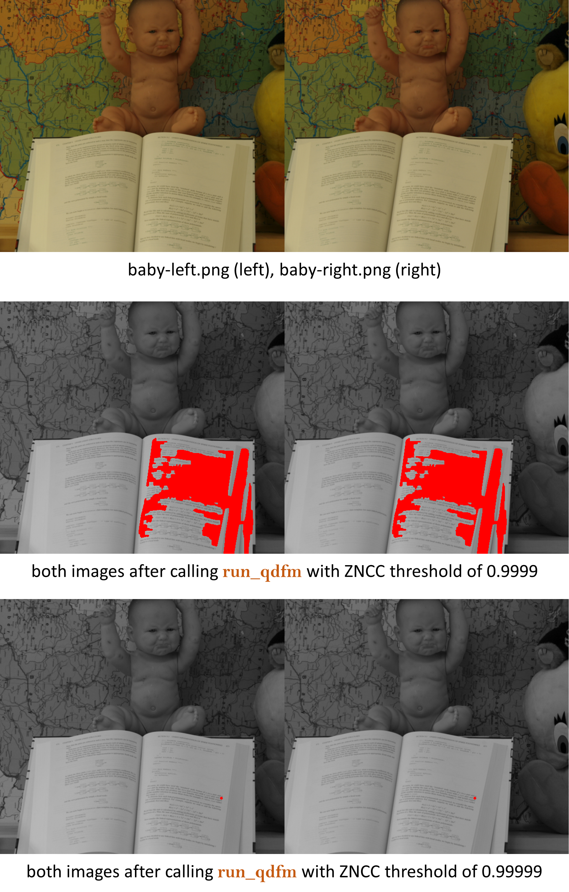

# (*Quasi-*) Dense Feature Matching for Structure from Motion

This minimalistic package (`qdfm`) was written as part of course project for Computer Vision for Engineers (CVE) taught by [Prof. Kenji Shimada](https://www.meche.engineering.cmu.edu/directory/bios/shimada-kenji.html) at [Carnegie Mellon University](https://www.cmu.edu).

## Table of Contents

- [Overview](#overview)
- [Installation](#installation)
- [Quick Start](#quick-start)
- [Module Structure](#module-structure)
- [Evaluation](#evaluation)
- [References](#references)
- [License](#license)

## Overview

### Motivation [\[1\]](#references)
**Structure from Motion** (SfM) and **visual Simultaneous Localisation and Mapping** (vSLAM) are main techniques that are used to create 3D maps of robot surroundings and track camera positions in large spaces. However, these maps are often too sparse (less rich in features) to show all the details of the environment.

Using dense 3D modeling helps us understand scenes better and is useful in many fields like augmented reality, arts, self-driving cars, etc.

### Where We Are in SfM
Feature Detection &rarr; **(Dense) Feature Matching** &rarr; Pose Estimation &rarr; Triangulation &rarr; Bundle Adjustment &rarr; Dense Reconstruction &rarr; Visualisation.

The key idea is:

$1.$ The process begins by generating an initial set of matched feature points using SIFT or another robust algorithm. These matches are then passed into the $qdfm$ pipeline.

$2.$ $qdfm$ treats these initial matches as a heap of seed points. It searches the surrounding regions in both images — within a window of size $n$ — to identify additional matches that meet the $ZNCC$ threshold criteria. Each newly found match is added to the heap and becomes a seed point itself, enabling further propagation. This iterative process is known as **Match Propagation** [\[2\]](#references).

[!NOTE]
`run_qdfm()` does all these steps for you in one function call (end-to-end pipeline).

## Installation

**Prerequisites**  
- `Python 3.8` or higher
- External libraries: `numpy`, `opencv-python`, `matplotlib` (optional).

## Quick Start

```python
# import function from the library
from qdfm import run_qdfm

# display images with matched features
run_qdfm(path_to_stereo_img_1, path_to_stereo_img_2)
```
or use the `Python` builtin `help()` function

```python
help(run_qdfm)
```

> Please note that this (`qdfm`) is a purely first-principles implementation of the algorithm, for academic purposes. It is NOT optimised for speed/complexity. Current implementation has complexity around $O(n^4)$ where $n$ is the window size. It might take a few minutes to finish on standard images.


## Module Structure

```
qdfm/
├─__init__.py
├─ mysift.py    // functions to generate seed point pairs
├─ dense.py     // functions to propagate seed points
└─ plot.py      // functions to display results
```

## Evaluation

**Result on Standard Images**




Matched points are shown as red dots. When the ZNCC threshold is set to 0.9999, the matching spreads quickly from the starting pair and connects many points, like a chain reaction.

If the threshold is raised to 0.99999, the algorithm becomes more selective and only picks the strongest nearby points. This also makes it easier to see where the matching started (at the selected seed point pair taken from the output of the feature matching algorithm).


**Tip:** With $ZNCC$ threshold of $0.9999$, you can expect $qdfm$ to return **hundreds** of extra feature points __per initial seed point__ and can take several minutes to finish. Hence, the default is set to 0.99999.

**Further Improvements**

$1.$ Algorithmic complexity can be optimsed through vectorisation [\[3\]](#references), although it might prove to be a more detailed approach (for a course project).

$2.$ Newer parameters can be sought that might not only be computationally suitable, but also result in more robust feature matching [\[4\]](#references).

## References

$[1]$ Alcantarilla, P.F., Beall, C. and Dellaert, F., 2013, November. Large-scale dense 3D reconstruction from stereo imagery. In IEEE/RSJ international conference on intelligent robots and systems.

$[2]$ Lhuillier, M. and Quan, L., 2002. Match propagation for image-based modeling and rendering. IEEE Transactions on Pattern Analysis and Machine Intelligence, 24(8), pp.1140-1146.

$[3]$ Lin, C., Li, Y., Xu, G. and Cao, Y., 2017. Optimizing ZNCC calculation in binocular stereo matching. Signal Processing: Image Communication, 52, pp.64-73.

$[4]$ Nakhmani, A. and Tannenbaum, A., 2013. A new distance measure based on generalized image normalized cross-correlation for robust video tracking and image recognition. Pattern recognition letters, 34(3), pp.315-321.

---

### LICENSE

MIT License

Copyright &copy; 2025 Neel Joshi

Permission is hereby granted, free of charge, to any person obtaining a copy
of this software and associated documentation files (the "Software"), to deal
in the Software without restriction, including without limitation the rights
to use, copy, modify, merge, publish, distribute, sublicense, and/or sell
copies of the Software, and to permit persons to whom the Software is
furnished to do so, subject to the following conditions:

The above copyright notice and this permission notice shall be included in all
copies or substantial portions of the Software.

THE SOFTWARE IS PROVIDED "AS IS", WITHOUT WARRANTY OF ANY KIND, EXPRESS OR
IMPLIED, INCLUDING BUT NOT LIMITED TO THE WARRANTIES OF MERCHANTABILITY,
FITNESS FOR A PARTICULAR PURPOSE AND NONINFRINGEMENT. IN NO EVENT SHALL THE
AUTHORS OR COPYRIGHT HOLDERS BE LIABLE FOR ANY CLAIM, DAMAGES OR OTHER
LIABILITY, WHETHER IN AN ACTION OF CONTRACT, TORT OR OTHERWISE, ARISING FROM,
OUT OF OR IN CONNECTION WITH THE SOFTWARE OR THE USE OR OTHER DEALINGS IN THE
SOFTWARE.

---
